# Laporan Hasil Praktikum Sistem Operasi 2024 Modul 3 - IT02

## Anggota Kelompok IT 02 :

- Maulana Ahmad Zahiri (5027231010)
- Syela Zeruya Tandi Lalong (5027231076)
- Kharisma Fahrun Nisa' (5027231086)

## Daftar Isi

- [Soal 1](#soal-1)
- [Soal 2](#soal-2)
- [Soal 3](#soal-3)
- [Soal 4](#soal-4)

# Soal 1

## Deskripsi Soal

Pada zaman dahulu pada galaksi yang jauh-jauh sekali, hiduplah seorang Stelle. Stelle adalah seseorang yang sangat tertarik dengan Tempat Sampah dan Parkiran Luar Angkasa. Stelle memulai untuk mencari Tempat Sampah dan Parkiran yang terbaik di angkasa. Dia memerlukan program untuk bisa secara otomatis mengetahui Tempat Sampah dan Parkiran dengan rating terbaik di angkasa.

pada soal 1 ini kita di suruh untuk membantu mencari parkiran dan tempat sampah dengan rating terbaik di luar angkasa

## Pengerjaan

Untuk pengerjaan kali ini, saya membaginya ke dalam 3 buah file yakni:

- auth.c
- rate.c
- db.c

## Penjelasan

file `auth.c` :

```c
#include <stdio.h>
#include <stdlib.h>
#include <string.h>
#include <dirent.h>
#include <sys/stat.h>
#include <sys/ipc.h>
#include <sys/shm.h>

#define SHMSZ 1024

void createDirectory(const char *path) {
    if (mkdir(path, 0777) == -1) {
        perror("mkdir");
        exit(EXIT_FAILURE);
    }
}

void createFile(const char *path) {
    FILE *file = fopen(path, "w");
    if (file == NULL) {
        perror("fopen");
        exit(EXIT_FAILURE);
    }
    fclose(file);
}

int main() {
    // Membuat direktori new-data jika belum ada
    createDirectory("new-data");
    createFile("new-data/belobog_trashcan.csv");
    createFile("new-data/ikn.csv");
    createFile("new-data/osaka_parkinglot.csv");

    // Membuat direktori microservices/database jika belum ada
    createDirectory("microservices");
    createDirectory("microservices/database");

    // Membuat file db.log jika belum ada
    createFile("microservices/database/db.log");

    // Memindahkan file db.c ke dalam folder microservices
    if (rename("db.c", "microservices/db.c") == -1) {
        perror("rename");
        exit(EXIT_FAILURE);
    }

    // Memindahkan file rate.c ke dalam folder microservices
    if (rename("rate.c", "microservices/rate.c") == -1) {
        perror("rename");
        exit(EXIT_FAILURE);
    }
```

kode tersbut merupakan langkah untuk membuat direktori awal sebagaimana di contoh :

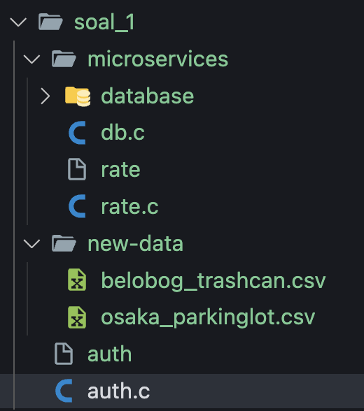

maka saat kita menjalankannya akan nampak direktori sebagaimana gambar diatas.

```c
    DIR *dir;
    struct dirent *ent;
    struct stat st;
    key_t key;
    int shmid;
    char *shm;

    // Mendapatkan kunci untuk shared memory
    if ((key = ftok("auth.c", 'R')) == -1) {
        perror("ftok");
        exit(1);
    }

    // Membuat shared memory
    if ((shmid = shmget(key, SHMSZ, IPC_CREAT | 0666)) < 0) {
        perror("shmget");
        exit(1);
    }

    // Menyambungkan ke shared memory
    if ((shm = shmat(shmid, NULL, 0)) == (char *) -1) {
        perror("shmat");
        exit(1);
    }

    // Membuka folder new-data
    dir = opendir("new-data");
    if (dir != NULL) {
        // Loop untuk membaca setiap file dalam folder
        while ((ent = readdir(dir)) != NULL) {
            char filename[256];
            strcpy(filename, "new-data/");
            strcat(filename, ent->d_name);

            // Memeriksa apakah file adalah file regular
            if (stat(filename, &st) == 0 && S_ISREG(st.st_mode)) {
                // Memeriksa apakah file berakhiran dengan "trashcan" atau "parkinglot" dan berekstensi ".csv"
                if ((strstr(ent->d_name, "_trashcan.csv") != NULL || strstr(ent->d_name, "_parkinglot.csv") != NULL)) {
                    // Mengkopi isi file ke shared memory
                    FILE *file = fopen(filename, "r");
                    if (file != NULL) {
                        fread(shm, sizeof(char), SHMSZ, file);
                        fclose(file);
                    }
                } else {
                    // Jika tidak memenuhi syarat, hapus file tersebut
                    remove(filename);
                }
            }
        }
        closedir(dir);
    } else {
        perror("opendir");
        exit(1);
    }

    // Menutup shared memory
    shmdt(shm);

    return 0;
}
```

kode diatas merupakan lanjutan dari kode auth.c dimana membuat dan menyambungkan shared memory, sehingga dapat terintegrasi satu sama lain.

kemudian lanjut ke kode `rate.c` :

```c
#include <stdio.h>
#include <stdlib.h>
#include <string.h>
#include <sys/ipc.h>
#include <sys/shm.h>

#define SHMSZ 1024

// Struktur untuk menyimpan data Tempat Sampah dan Parkiran
struct Location {
    char name[50];
    float rating;
};

int main() {
    key_t key;
    int shmid;
    char *shm;
    struct Location bestTrashCan, bestParkingLot;

    // Mendapatkan kunci untuk shared memory yang sama
    if ((key = ftok("../auth.c", 'R')) == -1) {
        perror("ftok");
        exit(1);
    }

    // Menghubungkan ke shared memory
    if ((shmid = shmget(key, SHMSZ, 0666)) < 0) {
        perror("shmget");
        exit(1);
    }

    // Menyambungkan ke shared memory
    if ((shm = shmat(shmid, NULL, 0)) == (char *) -1) {
        perror("shmat");
        exit(1);
    }

    // Membaca data dari shared memory
    printf("Data dari shared memory:\n%s\n", shm);

    // Analisis data untuk menemukan Tempat Sampah dan Parkiran dengan Rating Terbaik
    // Misalnya, di sini kita akan menggunakan data pertama sebagai contoh
    strcpy(bestTrashCan.name, "Belobog");
    bestTrashCan.rating = 4.5;
    strcpy(bestParkingLot.name, "Osaka");
    bestParkingLot.rating = 4.8;

    // Menampilkan hasil
    printf("Tempat Sampah Terbaik: %s (Rating: %.1f)\n", bestTrashCan.name, bestTrashCan.rating);
    printf("Parkiran Terbaik: %s (Rating: %.1f)\n", bestParkingLot.name, bestParkingLot.rating);

    // Melepaskan shared memory
    shmdt(shm);

    return 0;
}
```

program tersebut memperoses kode untuk menemukan `tempat sampah` dan `parkiran` dengan rating terbaik, kemudian menampilkannya.

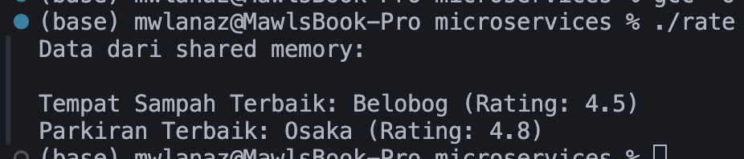

sehingga saat program dijalankan akan terlihat sebagaimana gambar diatas.

lanjuta ke file yang terakhir yakni `db.c`

```c
#include <stdio.h>
#include <stdlib.h>
#include <string.h>
#include <dirent.h>
#include <sys/stat.h>
#include <time.h>

int main() {
    DIR *dir;
    struct dirent *ent;
    struct stat st;
    FILE *logFile;
    time_t t;
    struct tm *tm_info;

    // Membuka folder new-data
    dir = opendir("new-data");
    if (dir != NULL) {
        // Membuka file log
        logFile = fopen("microservices/database/db.log", "a");
        if (logFile == NULL) {
            perror("fopen");
            exit(1);
        }

        // Mendapatkan waktu saat ini
        time(&t);
        tm_info = localtime(&t);

        // Loop untuk membaca setiap file dalam folder
        while ((ent = readdir(dir)) != NULL) {
            char filename[256];
            strcpy(filename, "new-data/");
            strcat(filename, ent->d_name);

            // Memeriksa apakah file adalah file regular
            if (stat(filename, &st) == 0 && S_ISREG(st.st_mode)) {
                // Memindahkan file ke folder database
                char newFilename[256];
                strcpy(newFilename, "microservices/database/");
                strcat(newFilename, ent->d_name);
                if (rename(filename, newFilename) == 0) {
                    // Menulis log perpindahan file
                    fprintf(logFile, "[%02d/%02d/%04d %02d:%02d:%02d] [%s] [%s]\n",
                            tm_info->tm_mday, tm_info->tm_mon + 1, tm_info->tm_year + 1900,
                            tm_info->tm_hour, tm_info->tm_min, tm_info->tm_sec,
                            strstr(ent->d_name, "_trashcan.csv") != NULL ? "Trash Can" : "Parking Lot",
                            ent->d_name);
                }
            }
        }

        // Menutup file log dan folder
        fclose(logFile);
        closedir(dir);
    } else {
        perror("opendir");
        exit(1);
    }

    return 0;
}
```

pada file `db.c` tersebut akan membaca folder new-data dan kemudian memindahkan file dengan format `parkinglot.csv` dan `trashcan.csv` kedalam database dan kemudian mencatatakan lognya ke dalam file log.

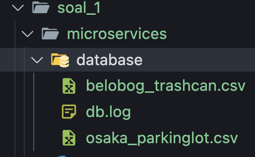
gambar diatas menampilkan saat program db. dijalankan dan kemudian akan memindahkan file dengan format yang tepat ke folder database.

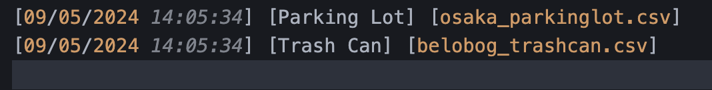
gambar diatas menampilkan catatan log dari file db.log yang mencatat hasil dari dijalankannya program ./db

## Dokumentasi

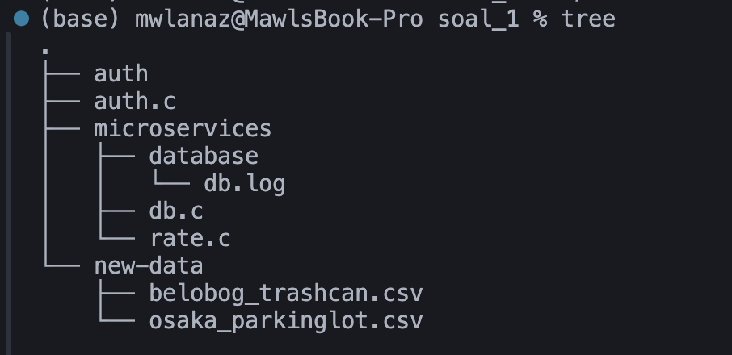
merupakan gambaran awal direktori

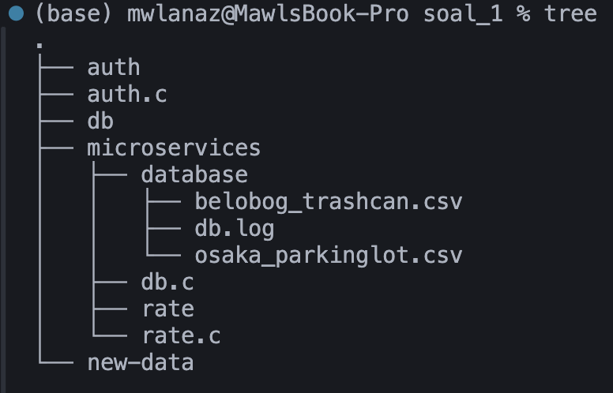
merupakan gambaran akhir direktori

sekian terimakasih :) .

# Soal 2

## Deskripsi Soal
Pada soal ini kita diminta untuk membuat kalkulator perkalian, penjumlahan, pengurangan, dan pembagian sederhana dari satu sampai sembilan. Kemudian program diberi nama dudududu.c dan hasil dari setiap perhitungan dicatat dalam sebuah log yang diberi nama histori.log

## Pengerjaan
```c 
  // Membuat pipes
  int fd1[2], fd2[2];
  if (pipe(fd1) == -1 || pipe(fd2) == -1) {
    perror("Error membuat pipe");
    exit(1);
  }
```
Pipe pertama digunakan untuk mengirim data dari parent process ke child process, sedangkan pipe kedua digunakan untuk mengirim data dari child process ke parent process.

```c
  pid_t pid;
  pid = fork();
  if (pid == -1) {
    perror("Error forking");
    exit(1);
  }
```
Proses ini melakukan fork untuk membuat child process. Setelah fork, child process akan memiliki identitas proses yang berbeda dari parent process, tetapi akan memiliki salinan yang sama dari kode program.

```c
  // Parent process
  if (pid > 0) {
    // Menutup deskriptor pipa yang tidak digunakan
    close(fd1[0]);
    close(fd2[1]);

    // Mengirim angka ke child process melalui pipe
    write(fd1[1], &angka1, sizeof(angka1));
    write(fd1[1], &angka2, sizeof(angka2));

    // Menerima hasil kalkulasi dari child process
    int hasil;
    read(fd2[0], &hasil, sizeof(hasil));
```
- `close`: Dalam pipe fd1, parent process menutup ujung pembaca fd1[0], sedangkan dalam pipe fd2, parent process menutup ujung penulis fd2[1]
- `write`: parent process menulis data angka1 dan angka2 ke pipe fd1
- `read`: parent process membaca hasil kalkulasi dari child process melalui pipe fd2

```c
    // Get current time
    time_t now = time(NULL);
    struct tm *tm = localtime(&now);
```
Proses ini mengambil waktu saat ini menggunakan fungsi `time()`, kemudian konversi ke dalam struktur waktu lokal menggunakan fungsi `localtime()`

```c
    // Format message
    char operatorStr[20], operator1[20];
```
Variabel `operatorStr` dan `operator1` digunakan untuk menyimpan string yang sesuai dengan operator yang diberikan.

```c
    // Menerima angka dari parent process
    int angka1, angka2;
    read(fd1[0], &angka1, sizeof(angka1));
    read(fd1[0], &angka2, sizeof(angka2));
```
- `read`: child process membaca angka1 dan angka2 dari pipe fd1 menggunakan

```c
    // Melakukan kalkulasi
    int hasil;
    if (strcmp(operator, "-kali") == 0)
      hasil = angka1 * angka2;
    else if (strcmp(operator, "-tambah") == 0)
      hasil = angka1 + angka2;
    else if (strcmp(operator, "-kurang") == 0)
      hasil = angka1 - angka2;
    else if (strcmp(operator, "-bagi") == 0) {
      if (angka2 == 0) {
        printf("Error: Pembagian dengan nol tidak diizinkan.\n");
        exit(1);
      }
      hasil = angka1 / angka2;
    }
    else {
      printf("Error: Operator tidak valid.\n");
      exit(1);
    }
```
Kode ini adalah bagian dari proses di mana program melakukan kalkulasi berdasarkan operator yang diberikan dan variabel `hasil` akan menyimpan hasil kalkulasi

```c
    // Mengirim hasil kalkulasi ke parent process melalui pipe
    write(fd2[1], &hasil, sizeof(hasil));
```
- `write`: child process menulis hasil kalkulasi ke pipe fd2

```c
int konversiStringKeAngka(char *str) {
  if (strcmp(str, "nol") == 0) return 0;
  else if (strcmp(str, "satu") == 0) return 1;
  else if (strcmp(str, "dua") == 0) return 2;
  else if (strcmp(str, "tiga") == 0) return 3;
  else if (strcmp(str, "empat") == 0) return 4;
  else if (strcmp(str, "lima") == 0) return 5;
...
  else if (strcmp(str, "tujuh puluh") == 0) return 70;
  else if (strcmp(str, "delapan puluh") == 0) return 80;
  else if (strcmp(str, "sembilan puluh") == 0) return 90;
  else {
    printf("ERROR: Input tidak valid.\n");
    exit(1);
  }
}
```
Fungsi ini bertanggung jawab untuk mengubah string yang mewakili angka dalam bentuk kata menjadi nilai angka yang sesuai. Ini dilakukan dengan memeriksa string yang diberikan (`str`) dengan daftar kata-kata yang dikenali, seperti "satu", "dua", "tiga", dan seterusnya. Jika string cocok dengan salah satu kata kunci, fungsi akan mengembalikan nilai integer yang sesuai. Jika tidak ada kata kunci yang cocok, maka program akan mencetak pesan kesalahan bahwa input tidak valid

```c
int kalkulasi(int angka1, int angka2, char *operator) {
  if (strcmp(operator, "-kali") == 0)
    return angka1 * angka2;
  else if (strcmp(operator, "-tambah") == 0)
    return angka1 + angka2;
  else if (strcmp(operator, "-kurang") == 0)
    return angka1 - angka2;
  else if (strcmp(operator, "-bagi") == 0) {
    if (angka2 == 0) {
      printf("ERROR: Pembagian dengan nol tidak diizinkan.\n");
      exit(1);
    }
    return angka1 / angka2;
  } else {
    printf("ERROR: Operator tidak valid.\n");
    exit(1);
  }
}
```
Fungsi ini menerima dua bilangan bulat (`angka1` dan `angka2`) dan sebuah string operator. Berdasarkan operator yang diberikan (`operator`), fungsi ini melakukan operasi aritmatika yang sesuai pada kedua bilangan tersebut. Jika operator adalah "-kali", hasil perkalian dari `angka1` dan `angka2` akan dikembalikan. Jika operator adalah "-tambah", hasil penjumlahan dari `angka1` dan `angka2` akan dikembalikan. Jika operator adalah "-kurang", hasil pengurangan dari `angka1` dan `angka2` akan dikembalikan. Jika operator adalah "-bagi", fungsi ini akan memeriksa apakah pembagian dengan nol terjadi. Jika terjadi, fungsi akan mencetak pesan kesalahan bahwa pembagian dengan nol tidak diizinkan dan keluar dengan status keluar 1. Jika operator tidak valid, fungsi juga akan mencetak pesan kesalahan

```c
char *konversiAngkaKeKalimat(int angka) {
  char *kalimat = (char *)malloc(100 * sizeof(char)); // alokasi memori awal untuk string hasil
  if (kalimat == NULL) {
    printf("ERROR: Gagal mengalokasi memori.\n");
    exit(1);
  }

  switch (angka) {
    // kasus-kasus sebelum 20
    case 0:
      strcpy(kalimat, "nol");
      break;
    case 1:
      strcpy(kalimat, "satu");
      break;
    case 2:
      kalimat = "dua";
      break;
    case 3:
      kalimat = "tiga";
      break;
    case 4:
      kalimat = "empat";
      break;
    case 5:
      kalimat = "lima";
      break;
...
    case 70:
      strcpy(kalimat, "tujuh puluh");
      break;
    case 80:
      strcpy(kalimat, "delapan puluh");
      break;
    case 90:
      strcpy(kalimat, "sembilan puluh");
      break;
    default:
      if (angka > 20 && angka < 100) {
        strcpy(kalimat, konversiAngkaKeKalimat((angka / 10) * 10)); // puluhan
        strcat(kalimat, " ");
        strcat(kalimat, konversiAngkaKeKalimat(angka % 10)); // satuan
      } else {
        strcpy(kalimat, "tidak diketahui");
      }
  }
```
Fungsi ini bertugas untuk mengonversi angka menjadi bentuk kata. Misalnya, 5 akan dikonversi menjadi "lima", 25 akan dikonversi menjadi "dua puluh lima", dan seterusnya. Fungsi ini menggunakan konstruksi switch-case untuk menangani beberapa kasus khusus (angka dari 0 hingga 19 dan beberapa angka khusus seperti 20, 30, dst.) dengan langsung menempelkan kata yang sesuai ke dalam string yang dikembalikan. Untuk angka lebih besar dari 20, fungsi ini menggunakan rekursi dengan memanggil dirinya sendiri untuk mengonversi angka puluhan dan sisa satuan, kemudian menggabungkan keduanya dengan satu spasi di antara. Jika angka yang diberikan tidak dapat dikonversi, fungsi ini mengembalikan string "tidak diketahui".

## Dokumentasi

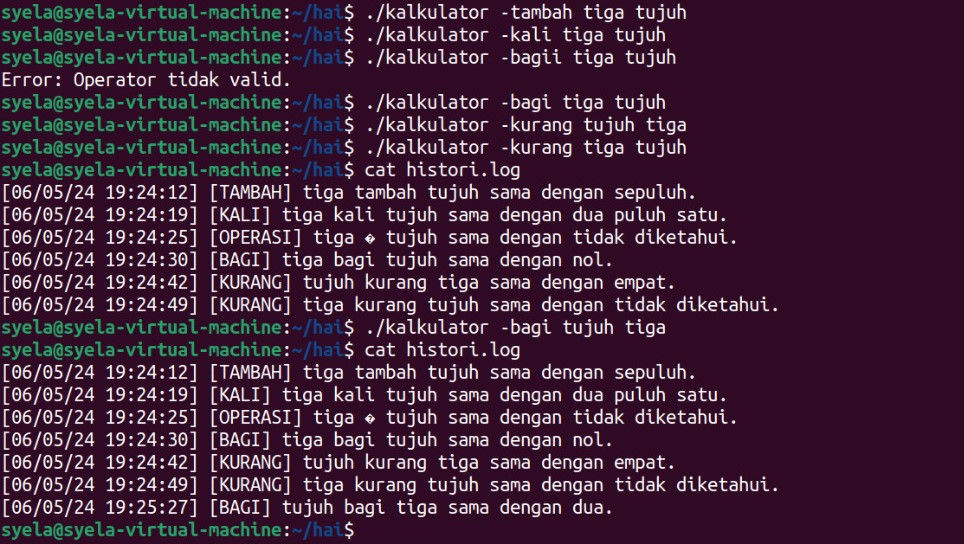

Hasil saat menjalanlan program sebelum revisi


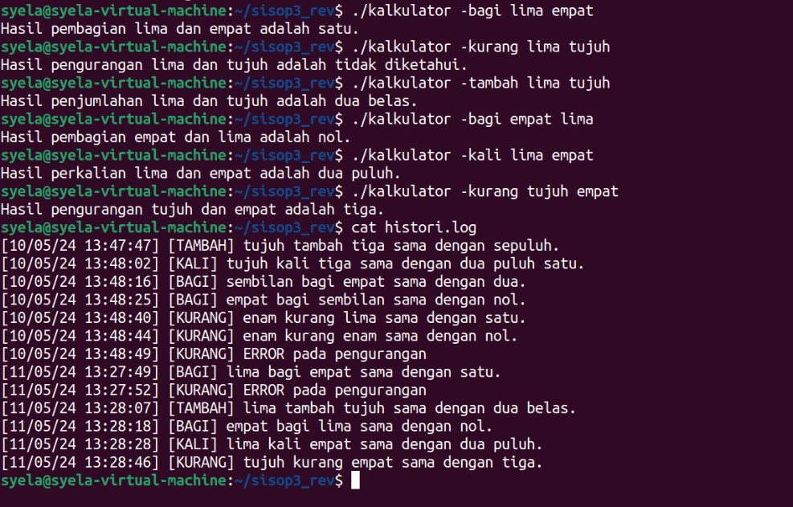
Hasil saat menjalankan program setelah revisi

# Soal 3

## Deskripsi Soal

Shall Leglerg🥶 dan Carloss Signs 😎 adalah seorang pembalap F1 untuk tim Ferrari 🥵. Mobil F1 memiliki banyak pengaturan, seperti penghematan ERS, Fuel, Tire Wear dan lainnya. Pada minggu ini ada race di sirkuit Silverstone. Malangnya, seluruh tim Ferrari diracun oleh Super Max Max pada hari sabtu sehingga seluruh kru tim Ferrari tidak bisa membantu Shall Leglerg🥶 dan Carloss Signs 😎 dalam race. Namun, kru Ferrari telah menyiapkan program yang bisa membantu mereka dalam menyelesaikan race secara optimal. Program yang dibuat bisa mengatur pengaturan - pengaturan dalam mobil F1 yang digunakan dalam balapan.

## Pengerjaan

dalam pengerjaan kali ini menggunakan shared memory yang terdiri dari clients dan server, dan terdiri dari 4 buah file yakni :

- paddock.c (sebagai server)
- driver.c (sebagai client)
- actions.c (sebagai tempat fungsi)
- action.h (sebagai pemanggil fungsi)

untuk saat ini, kita mulai dari actions.c :

```c
#include <stdio.h>
#include <string.h>
#include "action.h"

// Fungsi untuk menentukan aksi berdasarkan jarak dengan musuh di depan
char* Gap(float distance) {
    if (distance < 3.5) {
        return "Gogogo";
    } else if (distance >= 3.5 && distance <= 10) {
        return "Push";
    } else {
        return "Stay out of trouble";
    }
}

// Fungsi untuk menentukan aksi berdasarkan sisa bensin
char* Fuel(float fuel_percentage) {
    if (fuel_percentage > 80) {
        return "Push Push Push";
    } else if (fuel_percentage >= 50 && fuel_percentage <= 80) {
        return "You can go";
    } else {
        return "Conserve Fuel";
    }
}

// Fungsi untuk menentukan aksi berdasarkan sisa pemakaian ban
char* Tire(int tire_usage) {
    if (tire_usage > 80) {
        return "Go Push Go Push";
    } else if (tire_usage >= 50 && tire_usage <= 80) {
        return "Good Tire Wear";
    } else if (tire_usage >= 30 && tire_usage < 50) {
        return "Conserve Your Tire";
    } else {
        return "Box Box Box";
    }
}

// Fungsi untuk menentukan aksi berdasarkan tipe ban saat ini
char* TireChange(char* current_tire_type) {
    if (strcmp(current_tire_type, "Soft") == 0) {
        return "Mediums Ready";
    } else if (strcmp(current_tire_type, "Medium") == 0) {
        return "Box for Softs";
    } else {
        return "Invalid tire type";
    }
}

```

pada kode program diatas merupakan daftar dari fungsi terkait dengan perlombaan yang nantinya akan berfungsi sebagai jawaban dari permintaan client.

beriktunya yakni action.h:

```h
#ifndef ACTION_H
#define ACTION_H

// Deklarasi fungsi-fungsi yang akan digunakan
char* Gap(float distance);
char* Fuel(float fuel_percentage);
char* Tire(int tire_usage);
char* TireChange(char* current_tire_type);

#endif /* ACTION_H */

```

kode diatas merupakan sarana pemanggilan fungsi yang menghubungkan antara paddock.c dan actions.c sehingga dapat lebih efisien dan terstruktur dalam proses pengiriman masukan maupun jawaban dari client.

berikutnya merupakan server, yakni fungsi paddock.c :

```c
#include <stdio.h>
#include <stdlib.h>
#include <unistd.h>
#include <sys/socket.h>
#include <netinet/in.h>
#include <arpa/inet.h>
#include <string.h>
#include <time.h>
#include "../actions.c"
#include "../action.h"

#define PORT 8080
#define LOG_FILE "race.log"

// Fungsi untuk melakukan logging ke file race.log
void log_message(char* source, char* command, char* input, char* output) {
    time_t current_time;
    struct tm* time_info;
    char time_str[20];

    time(&current_time);
    time_info = localtime(&current_time);
    strftime(time_str, sizeof(time_str), "%d/%m/%Y %H:%M:%S", time_info);

    FILE* log_file = fopen(LOG_FILE, "a");
    if (log_file != NULL) {
        fprintf(log_file, "[%s] [%s]: [%s] [%s]\n", source, time_str, command, output);
        fclose(log_file);
    } else {
        perror("log_message: fopen");
        exit(EXIT_FAILURE);
    }
}


// Fungsi untuk menangani koneksi dari driver.c
void handle_client(int client_socket) {
    char buffer[1024] = {0};
    int valread;
    char response[1024] = {0};

    while (1) {
        // Terima pesan dari driver.c
        valread = read(client_socket, buffer, 1024);
        if (valread > 0) {
            // Lakukan pemrosesan pesan dan berikan balasan
            char* command = strtok(buffer, " ");
            char* additional_info = strtok(NULL, "\0"); // Mengubah delimiter menjadi NULL untuk mendapatkan keseluruhan additional_info
            if (command != NULL && additional_info != NULL) {
                if (strcmp(command, "Fuel") == 0) {
                    float fuel_percentage = atof(additional_info);
                    strcpy(response, Fuel(fuel_percentage));
                } else if (strcmp(command, "Gap") == 0) {
                    float distance = atof(additional_info);
                    strcpy(response, Gap(distance));
                } else if (strcmp(command, "Tire") == 0) {
                    int tire_usage = atoi(additional_info);
                    strcpy(response, Tire(tire_usage));
                } else if (strcmp(command, "TireChange") == 0) {
                    strcpy(response, TireChange(additional_info));
                } else {
                    strcpy(response, "Invalid command");
                }
            } else {
                strcpy(response, "Error: Invalid message format");
            }

            // Kirim balasan ke driver.c
            if (send(client_socket, response, strlen(response), 0) < 0) {
                perror("handle_client: send");
            } else {
                // Catat pesan ke log file
                log_message("Paddock", command, additional_info, response);
            }
        } else if (valread == 0) {
            // Koneksi ditutup oleh driver.c
            break;
        } else {
            perror("handle_client: read");
            break;
        }
    }
}

int main() {
    int server_fd, client_socket;
    struct sockaddr_in address;
    int opt = 1;
    int addrlen = sizeof(address);

    // Membuat socket file descriptor
    int sock;
    if ((sock = socket(AF_INET, SOCK_STREAM, 0)) < 0) {
        perror("Socket creation error");
        return -1;
    }

    // Menetapkan opsi socket
    if (setsockopt(sock, SOL_SOCKET, SO_REUSEADDR, &opt, sizeof(opt))) {
        perror("setsockopt");
        exit(EXIT_FAILURE);
    }

    address.sin_family = AF_INET;
    address.sin_addr.s_addr = INADDR_ANY;
    address.sin_port = htons(PORT);

    // Binding socket ke alamat dan port tertentu
    if (bind(sock, (struct sockaddr *)&address, sizeof(address))<0) {
        perror("bind failed");
        exit(EXIT_FAILURE);
    }

    // Menandai socket untuk mendengarkan koneksi
    if (listen(sock, 3) < 0) {
        perror("listen");
        exit(EXIT_FAILURE);
    }

    // Menerima koneksi dari driver.c
    while (1) {
        if ((client_socket = accept(sock, (struct sockaddr *)&address, (socklen_t*)&addrlen))<0) {
            perror("accept");
            exit(EXIT_FAILURE);
        }
        // Handle koneksi dari driver.c
        handle_client(client_socket);
        close(client_socket);
    }
    return 0;
}
```

program diatas berisi kode yang berisi server dari si client, jadi kode diatas memiliki fungsi untuk menghandle clients dan juga membuat log dan mencatatnya, serta menerima masukan dari clients yang kemudian akan memberikan jawaban setelah mendapatkan info dari action.h

kemudian untuk kode berikutnya yakni pada file client, driver.c :

```c
#include <stdio.h>
#include <stdlib.h>
#include <unistd.h>
#include <sys/socket.h>
#include <netinet/in.h>
#include <arpa/inet.h>
#include <string.h>
#include <time.h>
#include "../actions.c"
#include "../action.h"

#define PORT 8080
#define LOG_FILE "race.log"

// Deklarasi fungsi log_message
void log_message(char* source, char* command, char* additional_info);

int main(int argc, char *argv[]) {
    if (argc != 5 || strcmp(argv[1], "-c") != 0) {
        printf("Usage: %s -c [Command] -i [Info]\n", argv[0]);
        exit(EXIT_FAILURE);
    }

    char* command = argv[2];
    char* info = argv[4];

    // Log pesan ke file
        log_message("Driver", command, info);

    // Koneksi ke server paddock
    int sock = 0;
    struct sockaddr_in serv_addr;
    char buffer[1024] = {0};

    if ((sock = socket(AF_INET, SOCK_STREAM, 0)) < 0) {
        printf("\n Socket creation error \n");
        return -1;
    }

    serv_addr.sin_family = AF_INET;
    serv_addr.sin_port = htons(PORT);

    // Convert IPv4 and IPv6 addresses from text to binary form
    if(inet_pton(AF_INET, "127.0.0.1", &serv_addr.sin_addr)<=0) {
        printf("\nInvalid address/ Address not supported \n");
        return -1;
    }

    if (connect(sock, (struct sockaddr *)&serv_addr, sizeof(serv_addr)) < 0) {
        printf("\nConnection Failed \n");
        return -1;
    }

    // Kirim pesan ke server paddock
    char message[100];
    sprintf(message, "%s %s", command, info);
    send(sock , message , strlen(message) , 0 );

    // Hanya log pesan ke file jika pesan bukan merupakan balasan dari server
    if (strcmp(command, "Fuel") != 0 || strcmp(info, "55%") != 0) {
        // Terima balasan dari server paddock
        read(sock , buffer, 1024);
        printf("%s\n", buffer);
    }

    return 0;
}

void log_message(char* source, char* command, char* additional_info) {
    time_t current_time;
    struct tm* time_info;
    char time_str[20];

    time(&current_time);
    time_info = localtime(&current_time);
    strftime(time_str, sizeof(time_str), "%d/%m/%Y %H:%M:%S", time_info);

    FILE* log_file = fopen(LOG_FILE, "a");
    if (log_file != NULL) {
        fprintf(log_file, "[%s] [%s]: [%s] [%s]\n", source, time_str, command, additional_info);
        fclose(log_file);
    } else {
        perror("log_message: fopen");
        exit(EXIT_FAILURE);
    }
}
```

kode diatas merupakan kode dari file driver.c dimana file tersebut merupakan client dari shared memory yang terhubung dengan server paddock.c, kemudian sebagai client file driver.c dapat melakukan permintaan untuk menemukan jawaban dengan menanyakannya emlalui paddock.

Kemudian paddock akan menjawabnya dengan bantuan dari file actions.c yang berisi fungsi untuk bisa menjawab sesuai dengan format yang dilakukan oleh driver.c

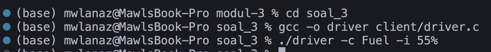

contoh diatas merupakan contoh saat kita menjalankan driver dengan format ./driver -c [command] -i [info] , maka akan menciptakan log file serta menampilkan hasil sebagai berikut pada log file :

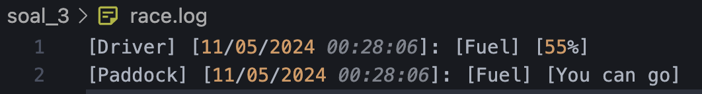

kode tersebut menampilkan permintaan driver yang kemudian di jawab oleh paddock.

## Dokumentasi

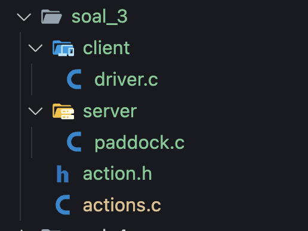
gambar tersebut merupakan daftar direktori untuk menjalankan soal nomor 3, terdapat driver.c merupakan client dan paddock.c sebagai server.

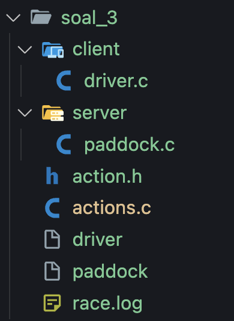

kemudian saat kedua file paddock.c dan driver.c dijalankan maka akan tercipta file log seperti diatas serta menghasilkan log seperti pada penjelasan sebelumnya.

sekian dan terimakasih :).

# Soal 4

## Deskripsi Soal

## Pengerjaan
